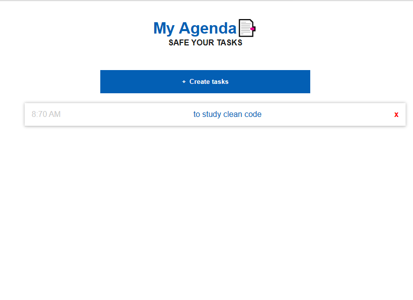

# Problem
Criar uma pequena agenda em que o usuario pode salvar as sua tarefas diarias.

# Resolution
Criei uma API que foca em guardar as informações do usuario num arquivo json em que o user pode salvar,eliminar as tarefas e tudo isso é consumidas por um front-end.

## tools:
- Node.js - Back-End
- jQuery - Front-End

### the project

